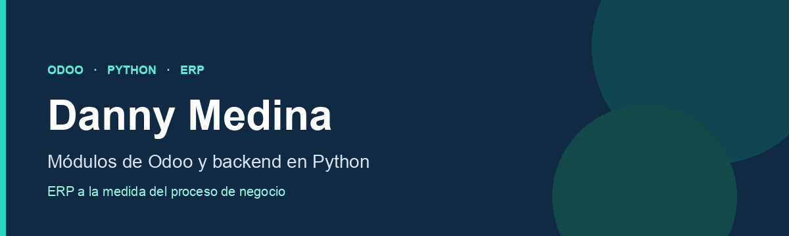

**Desarrollo software para empresas que trabajan con Odoo.**
Módulos del ERP, backend en Python y las pantallas, reportes y automatizaciones que el equipo usa cada día.

## Qué hago

- Módulos de Odoo adaptados al proceso del negocio, no a un solo departamento
- Backend en Python, modelos, reglas y flujos que se mantienen cuando Odoo se actualiza
- Pantallas, informes y documentos que el usuario entiende sin una guía al lado
- Integración con lo que Odoo ya trae: contabilidad, ventas, compras, inventario y operaciones

## Cómo trabajo

Construyo sobre el estándar de Odoo. Heredo modelos, vistas e informes y dejo el núcleo intacto, para que el sistema se pueda actualizar y el cambio se pueda explicar.

El código de clientes y los módulos comerciales están en repositorios privados.

## Stack

Python · Odoo · PostgreSQL · XML · QWeb · JavaScript · Git

## Contacto

Danny Medina · [github.com/DannyElian](https://github.com/DannyElian)
